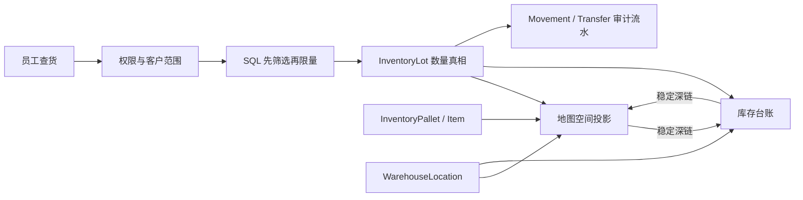
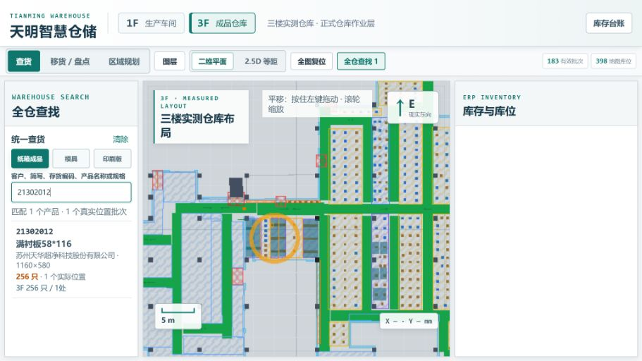
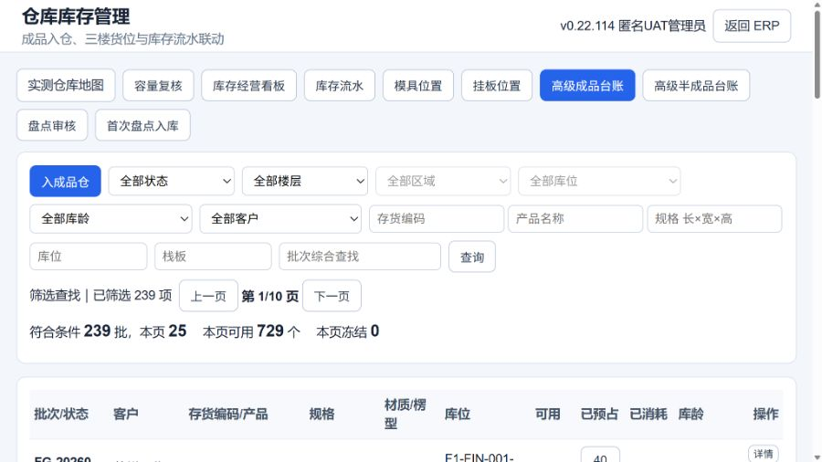
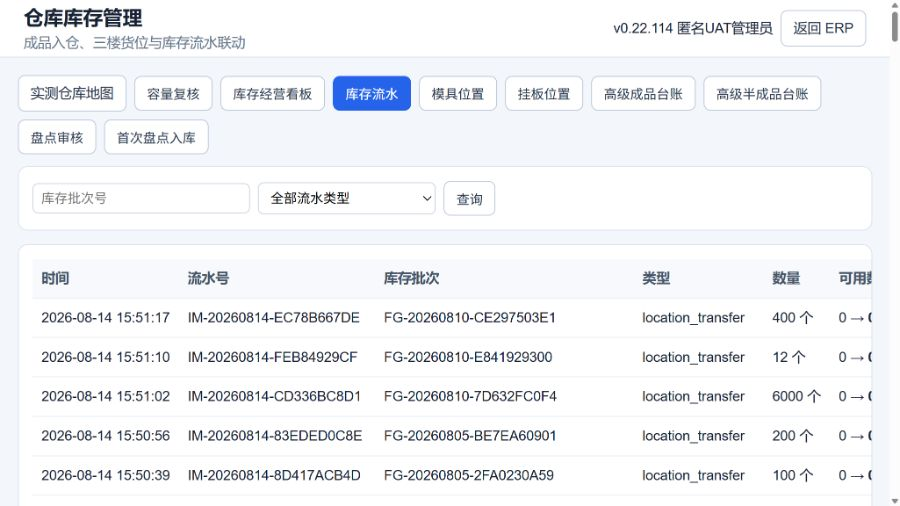
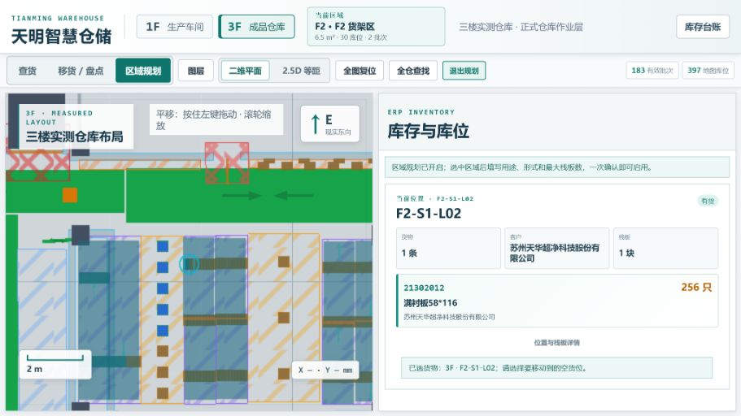
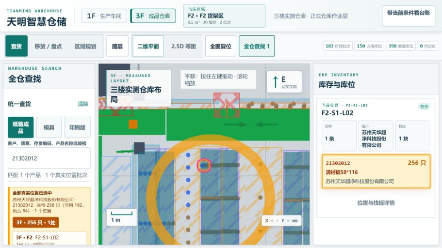
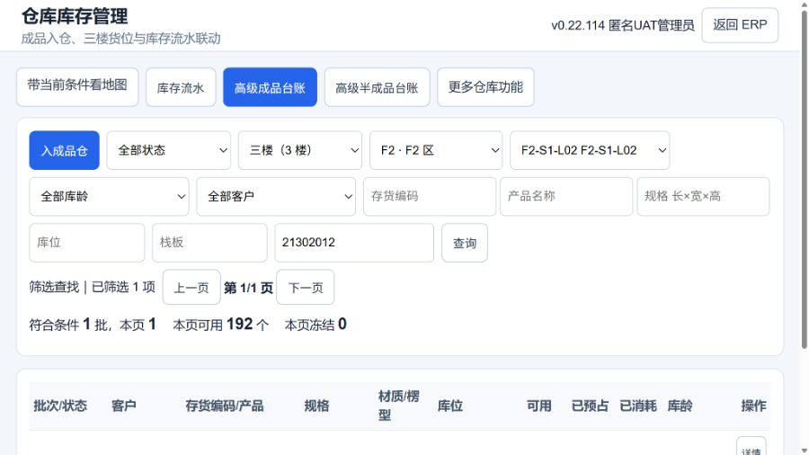
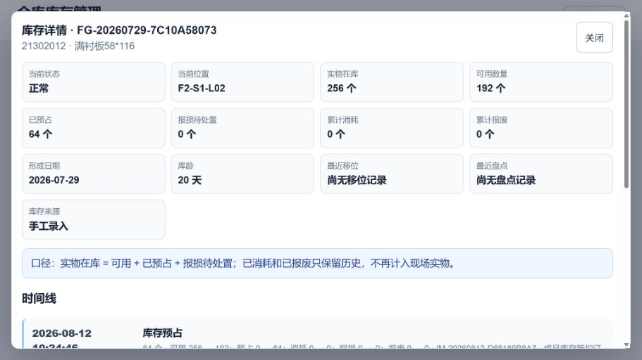
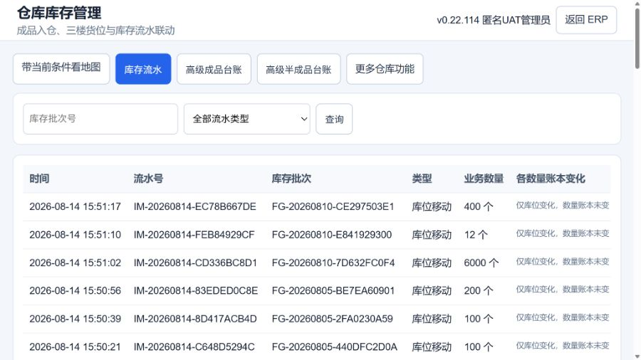
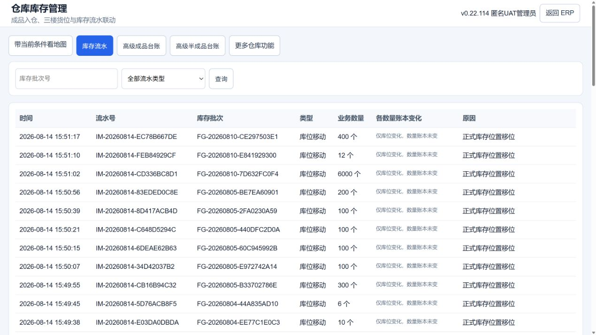

# P1-71 仓库地图与库存台账 UI、逻辑与数据流联合治理

审计日期：2026-08-18

审计基线：`d04d68db45c25b288ed4e83395de37b42f0b622b`

开发分支：`codex/p1-71-warehouse-map-ledger-20260818`
数据边界：只使用隔离 UAT 数据库副本；未读取或修改正式数据库、正式服务和 NAS 备份目录。

## 结论

本轮固定 20 个问题，按 P0→P2 排序后全部形成代码闭环。核心修正是：全仓查找先在数据库筛选再限量；地图和台账以楼层、库存类型、关键词、库位、批次作为稳定深链身份；所有界面统一区分实物、可用、预占、报损、耗用和报废；流水改为完整数量桶加分页；模式、弹窗、键盘与点击目标不再混乱。

本轮没有改变库存事实模型，也没有新增迁移：地图仍是库存台账的空间投影，`InventoryLot` 仍是数量真相，`InventoryMovement` 与 `InventoryLotTransfer` 仍是不可变审计事实。

## UI 逻辑与数据走向

1. 用户在实测地图输入客户、存货编码、产品、批次、库位或栈板关键字。
2. `GET /api/warehouse/twin-dashboard/search` 先应用账号权限与客户范围，再由 SQL 在批次、成品/半成品快照、客户、库位和栈板字段中筛选。
3. 返回结果按楼层、区域、库位投影到地图；缺少已发布坐标时只显示“真实文字位置”，不伪造地图点。
4. 地图数量来源于 `InventoryLot`：实物在库 = 可用 + 预占 + 报损待处置；已耗用、已报废只保留历史。
5. 用户点击“带当前条件看台账”，URL 带上库存类型、楼层、关键词、库位和批次；台账重新从正式 API 读取，不把地图卡片当第二份库存真相。
6. 台账筛选、分页、打开批次详情和流水均为只读 GET；页面把当前筛选同步到 URL，刷新和前后退仍可恢复上下文。
7. 真正入库、预占、消耗、报损、报废、移库仍走原有写接口、权限、客户范围、版本、幂等、事务和审计门禁；本轮没有放宽。

## 20 个问题与修复优先级

| # | 优先级 | 问题 | 风险 | 修复结果 |
|---:|:---:|---|---|---|
| 1 | P0 | 全仓查找只读取前 2,500 个批次再在 Python 搜索 | 有效库存排在后面会无提示漏掉 | 改为 SQL 先筛选、权限范围不变、再限制 500 条；返回真实匹配总数和截断提示，并以 2,506 批动态回归覆盖 |
| 2 | P1 | 地图跳台账固定进入成品页 | 半成品、当前楼层和对象身份丢失 | 动态生成台账链接，携带库存类型、楼层、关键词、库位与批次 |
| 3 | P1 | 台账返回地图只打开空白默认地图 | 员工需重新搜索，容易点错货位 | 反向携带库存类型、楼层、关键词和库位 |
| 4 | P1 | 页面不维护 URL 状态 | 刷新、前后退或复制链接后上下文丢失 | 地图与台账均使用 `history.replaceState` 同步只读筛选身份 |
| 5 | P1 | 查货、移货和区域规划切换时继承来源、消息或草稿 | 旧状态可能被误认为当前操作 | 离开移货前检测未提交状态并确认；离开后清空来源、数量、目标、消息和幂等草稿 |
| 6 | P1 | 栈板存在第二套尺寸来源，搜索高亮可变成遮住货架的巨大框 | 碰撞提示、占位和现场认知失真 | 合并 P1-70，物理栈板统一 1200×1000×150 mm；缺失、非法或不一致时失败关闭 |
| 7 | P1 | 地图结果只给一个“数量” | 256 实物与 192 可用看似互相矛盾 | 搜索组和焦点卡同时显示实物、可用、预占、报损待处置 |
| 8 | P1 | 批次详情隐藏数量桶和公式 | 无法解释预占、损坏与现场实物差异 | 显示实物、可用、预占、报损、累计耗用、累计报废，并明确公式 |
| 9 | P1 | 库存来源直接显示 `manual` 等技术码 | 文员难以判断事实来源 | 统一使用手工录入、生产完工、盘点录入、退货入库等中文标签 |
| 10 | P1 | 流水筛选缺消耗、撤销消耗、退货、移库等正式类型 | 有流水但 UI 无法筛选 | 补齐现有全部正式枚举，不新增业务类型 |
| 11 | P1 | 流水只显示可用量变化 | 预占、耗用、报损、报废变化被隐藏；移库显示 0→0 很误导 | 每行只列真实发生变化的五个数量桶；纯位置/状态变化明确说明数量账本未变 |
| 12 | P1 | 流水固定最多 200 条且无总数/分页 | 老流水静默不可见 | 改为每页 50 条、显示总数和页数、支持上一页/下一页且保留 latest-request 防竞态 |
| 13 | P1 | 批次详情弹窗和背景同时可滚 | 形成双滚动，关闭后位置不稳定 | 打开详情时锁定背景，弹窗成为唯一滚动容器并设置 overscroll containment |
| 14 | P1 | 详情弹窗缺焦点陷阱和焦点归还 | 键盘用户可跑到遮罩后，关闭后丢位置 | 补 `dialog` 语义、Tab/Shift+Tab 循环、Esc、遮罩关闭和原按钮焦点归还 |
| 15 | P1 | 1366 嵌入宽度隐藏“占用库位/待定位” | 最关键空间质量指标不可见 | 在 1180px 嵌入断点恢复两项；仅 880px 以下移动窄屏隐藏整组摘要 |
| 16 | P1 | 高频按钮、输入和筛选目标普遍只有 26–36px | 工厂触控、戴手套或快速操作易误触 | 地图高频目标统一至少 44px；台账主导航、工具栏、筛选和详情按钮至少 44px，并补焦点轮廓 |
| 17 | P2 | 2.5D 禁用原因只在鼠标 `title` | 键盘与读屏用户不知道为什么不可用 | 增加 `aria-describedby` 的同屏隐藏说明，保留可见标题提示 |
| 18 | P2 | 操作模式、视图和查找类型只是普通按钮组 | 读屏无法知道当前选择 | 增加 `tablist`、`tab`、`aria-selected` 和楼层 `aria-current` |
| 19 | P2 | 空白检查器只是一块空区域，零草稿确认按钮显示不完整 | 新员工不知道下一步，可能把查看误解为写操作 | 补四步查货指引、数据边界说明；零草稿按钮显示“先加入移货草稿” |
| 20 | P2 | 台账顶部十个同权入口挤占横向空间 | 日常成品/半成品/流水被管理工具淹没 | 保留地图、流水、成品、半成品四个主入口；容量、经营、模具、挂板、盘点、首次入库收进“更多仓库功能” |

## 审计截图

### 修改前：全仓搜索与数量口径

### 修改前：库存台账与固定顶部入口

### 修改前：流水只显示可用量且没有分页

### 修改前：模式串状态

### 修改后：地图搜索、数量口径与稳定深链

### 修改后：带条件进入库存台账

### 修改后：批次详情数量公式与单滚动对话框

### 修改后：完整库存流水、数量桶与分页

### 修改后：1920 宽台账布局

## 保护的不变量

- `InventoryLot` 数量、状态与版本不因地图查看或台账查看改变。
- `InventoryMovement`、`InventoryLotTransfer` 继续作为审计流水，不因 UI 展示而重写。
- 地图坐标、栈板与库位是空间投影，不生成虚假库存或第二套数量真相。
- 权限、客户范围、幂等、乐观版本、事务、操作日志和失败无半写入契约不放宽。
- 本轮不迁移、不回填、不修正任何正式库存、库位、栈板或盘点事实。

## 验收状态

- 开发与自动回归：React 地图组件 69 项全绿；P1-71 专项、仓库前端与搜索后端定向回归全绿。扩大仓库回归中的 5 个旧前端字符串断言已同步；另有 15 个 P1-47C 既有 fixture 缺少 `expected_target_layout_version`，属于本基线测试债务，不是本轮运行逻辑回归。
- 隔离 UAT Chrome：已完成 1366 / 1920 对照；验证地图搜索、地图→台账→地图条件传递、页面刷新保持页签、数量口径、流水 570 条/每页 50 条、详情背景锁、Tab/Shift+Tab、Esc 与焦点归还。
- 正式 ERP 人工验收：待老板完成，不宣称已通过。
